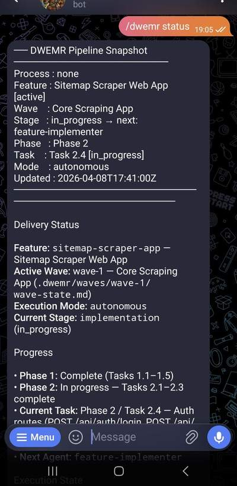

# Delivery Workflow Engine & Memory Relay (DWEMR)


DWEMR installs a Claude-native delivery workflow into a target project, exposes the public `/dwemr` command surface through OpenClaw, and keeps the plugin runtime separate from the project-local workflow it provisions.

It works as an OpenClaw plugin for Claude subagent orchestration with a state-first memory model. DWEMR keeps a structured state and memory layer inside each target project so work can resume from where it left off instead of depending on one live session. If Claude, OpenClaw, or the surrounding session drops, you can continue from the latest saved checkpoint and keep moving.

DWEMR is designed specifically for OpenClaw. That said, the project-local memory files and subagent prompts could be extracted and adapted for standalone Claude workflows with some extra effort.

## Why I Built It

I built DWEMR for people like me: non-developers who still need real tools and small apps on demand.

DWEMR is not meant to produce enterprise-grade, production-hardened software that perfectly follows every best practice. The goal is to ship something functional, well-shaped, and useful enough to solve the problem in front of you, with room to improve later if it proves worth keeping.

My own workflow was always the same. I would quickly vibe-code something to solve a problem in the moment, use it once, then leave behind a half-shaped project with unclear structure, weak handoff, and no real path to keep improving it later.

DWEMR is my attempt to make that process more usable. The goal is simple: send a rough request, let the system turn it into a functional, well-shaped app or tool, ship it to GitHub, and have something you can actually use right away, even if it still needs iteration.

It is designed to be AI-first and user-guiding. It tries to handle poor prompts, clarify what should happen next, and keep the workflow approachable for people who are not professional software engineers.

My personal setup is an OpenClaw bot with its own GitHub account and isolated environment, connected to Telegram and running on an M4 Mac mini 7/24. I send it a request, it builds and ships the tool, and I use the result directly or with only minor changes/fixes.



## Install The Plugin

```bash
openclaw plugins install dwemr
openclaw gateway restart
```

If you need runtime overrides after install, configure `plugins.entries.dwemr.config` in your OpenClaw config.

DWEMR relies on OpenClaw's ACPX runtime for Claude execution. If a fresh-machine install reports no ACPX runtime found, see the troubleshooting note in [plugins/dwemr/README.md](plugins/dwemr/README.md).

## Before You Use It

DWEMR is designed to be hands-off inside the target project, and that comes with tradeoffs.

- it installs a project-local `.claude/settings.json` with permissive Claude execution settings so the workflow can run unattended
- it is not optimized for minimal token usage, and cost can climb quickly in longer runs, especially in `standard_app`
- if you want the leanest path, steer onboarding toward a minimal tool workflow from the start

See [plugins/dwemr/README.md](plugins/dwemr/README.md) for the full runtime, safety, and cost notes.

## Real-World Benchmark

My latest test run was a single prompt:

```text
/dwemr start Build a web app that explores a website's sitemap, scrapes every HTML page, converts each page to Markdown, and indexes the content. Offer bulk index (append all content together) or preserve HTML structure in separate indexed files. Allow downloading indexed content. Save historical indexed files so users can download them any time.
```

That run produced the `Test10` app, which I published publicly on my GitHub profile so it can be inspected. It took about 6 hours total, including roughly 1 hour of interruption, using Claude Sonnet with medium effort. On my Max plan it consumed roughly 50 to 60 percent of the 5-hour limit.

I only made one minor follow-up AI patch after the run, unrelated to the core product behavior. Everything else came from the original DWEMR workflow output.

The result is not flawless, but it does the job I actually wanted: it discovers sitemaps from a given site URL, scrapes the pages, converts them to Markdown, indexes them in either structured or appended form, keeps historical outputs, and lets users download them later. The task state is also persistent, so work can resume after interruption.

It still has rough edges. User authentication exists, but user creation is manual. The sample URL copy suggests `https://example.com/sitemap.xml`, while the app is really designed to discover sitemaps from the base site URL instead of accepting a sitemap URL directly. Still, the main goal was achieved: a usable, reasonably clean, well-structured app that solves the requested problem and leaves room for future improvement.

## Local Development

```bash
openclaw plugins install -l ./plugins/dwemr
openclaw gateway restart
```

## Support

- Issues: [https://github.com/quareth/Dwemr/issues](https://github.com/quareth/Dwemr/issues)
- Plugin docs: `plugins/dwemr/README.md`

## Roadmap

Near-term work I want to focus on:

1. Prompt deduplication, prompt optimization, memory deduplication, and general repo cleanup.
2. A token spend counter so usage is easier to see while DWEMR is running.
3. Broader token optimization across the workflow, especially in heavier paths like `standard_app`.
4. A feature add command that lets users add a single feature to an existing DWEMR-managed project without starting from scratch.
